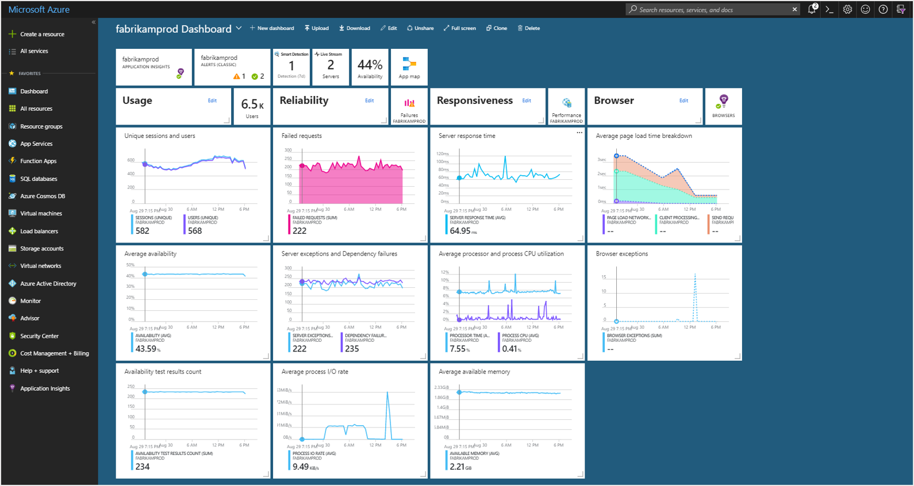

# Azure Application Insights Module

## Overview

Azure Application Insights module collecting metric, application telemetry data and application trace logging data in Microsoft Azure Application Insights.



## Key Features

* Collecting standard metric.
* Collecting application telemetry data.
* Collecting application trace logging data.
* Flexible configuration by config and code.


## Configuring Telemetry

The simplest way to configure module to send data to an Application Insights dashboard via instrumentation key is to use current active telemetry configuration which is already initialized in most application types like ASP.NET Core:

```JSON
{
  "ApplicationInsights": {
    "ConnectionString": "<Copy connection string from Application Insights Resource Overview>"
  }
}
```

Configure Platform AP telemetry behavior inside `VirtoCommerce:ApplicationInsights` section: 

```JSON
{
    "VirtoCommerce": {
        "ApplicationInsights": {
            "SamplingOptions": {
                "Processor": "Adaptive",
                "Adaptive": {
                    "MaxTelemetryItemsPerSecond": "5",
                    "InitialSamplingPercentage": "100",
                    "MinSamplingPercentage": "0.1",
                    "MaxSamplingPercentage": "100",
                    "EvaluationInterval": "00:00:15",
                    "SamplingPercentageDecreaseTimeout": "00:02:00",
                    "SamplingPercentageIncreaseTimeout": "00:15:00",
                    "MovingAverageRatio": "0.25"
                },
                "Fixed": {
                    "SamplingPercentage": 90
                },
                "IncludedTypes": "Dependency;Event;Exception;PageView;Request;Trace",
                "ExcludedTypes": ""
            },
            "EnableSqlCommandTextInstrumentation": true,
            "IgnoreSqlTelemetryOptions": {
                "QueryIgnoreSubstrings": [
                    "[HangFire].",
                    "sp_getapplock",
                    "sp_releaseapplock"
                ]
            }
        }
    }
}
```

`SamplingOptions.Processor`: this setting lets you chose between two sampling methods:
* **Adaptive sampling**: automatically adjusts the volume of telemetry sent from the SDK in your ASP.NET/ASP.NET Core app, and from Azure Functions. More about this configuring this option [here](https://learn.microsoft.com/en-us/azure/azure-monitor/app/sampling?tabs=net-core-new#configuring-adaptive-sampling-for-aspnet-applications). 
* **Fixed-rate sampling**: reduces the volume of telemetry sent from both the application. Unlike adaptive sampling, it reduces telemetry at a fixed rate controlled by `SamplingPercentage` setting. 

`IncludedTypes`: a semi-colon delimited list of types that you do want to subject to sampling. Recognized types are: Dependency, Event, Exception, PageView, Request, Trace. The specified types will be sampled; all telemetry of the other types will always be transmitted. All types included by default.

`ExcludedTypes`: A semi-colon delimited list of types that you do not want to be subject to sampling. Recognized types are: Dependency, Event, Exception, PageView, Request, Trace. All telemetry of the specified types is transmitted; the types that aren't specified will be sampled. Empty by default.

`EnableSqlCommandTextInstrumentation`: For SQL calls, the name of the server and database is always collected and stored as the name of the collected DependencyTelemetry. Another field, called data, can contain the full SQL query text. To opt in to SQL Text collection set this setting to `true`.

`IgnoreSqlTelemetryOptions`: Controls Application Insight telemetry processor thats excludes dependency SQL queries by. Any SQL command name or statement that contains a string from `QueryIgnoreSubstrings` options will be ignored.

This module supports configuration by config and code. You can read more about configuration [here](https://github.com/serilog-contrib/serilog-sinks-applicationinsights)


## Configure Logging from configuration

The module comes with a [sink](https://github.com/serilog-contrib/serilog-sinks-applicationinsights) for Serilog that writes events to Microsoft Application Insights. To enable AI logging update the following `Serilog` configuration sections:

```JSON
{
  "Serilog": {
    "Using": [
      "Serilog.Sinks.ApplicationInsights"
    ],
    "WriteTo": [
      {
        "Name": "ApplicationInsights",
        "Args": {
          "connectionString": "<Copy connection string from Application Insights Resource Overview>",
          "telemetryConverter": "Serilog.Sinks.ApplicationInsights.TelemetryConverters.TraceTelemetryConverter, Serilog.Sinks.ApplicationInsights",
          "restrictedToMinimumLevel": "Error"
        }
      }
    ]
  }
}
```

The telemetryConverter has to be specified with the full type name and the assembly name. A connectionString can be omitted if it's supplied in the APPLICATIONINSIGHTS_CONNECTION_STRING environment variable.

## Configure Logging from code

In cases where you need to configure Serilog's Application Insights sink from your code instead of the configuration file you can use special `ILoggerConfigurationService` interface:

```cs
public class ApplicationInsightsLoggerConfiguration : ILoggerConfigurationService
{
    private readonly TelemetryConfiguration _configuration;

    public ApplicationInsightsLoggerConfiguration(TelemetryConfiguration configuration)
    {
        _configuration = configuration;
    }

    public void Configure(LoggerConfiguration loggerConfiguration)
    {
        loggerConfiguration.WriteTo.ApplicationInsights(telemetryConfiguration: _configuration,
        telemetryConverter: TelemetryConverter.Traces,
        restrictedToMinimumLevel: Serilog.Events.LogEventLevel.Error);
    }
}
```

and register in `Module.cs` `Initialize` method:

```cs
public void Initialize(IServiceCollection serviceCollection)
{
    serviceCollection.AddTransient<ILoggerConfigurationService, ApplicationInsightsLoggerConfiguration>();
}
```

## References
* [Application Insights Overview](https://learn.microsoft.com/en-us/azure/azure-monitor/app/app-insights-overview)
* [Serilog Library](https://serilog.net/)
* Deployment: https://docs.virtocommerce.org/developer-guide/deploy-module-from-source-code/
* Installation: https://docs.virtocommerce.org/user-guide/modules/
* Home: https://virtocommerce.com
* Community: https://www.virtocommerce.org
* [Download Latest Release](https://github.com/VirtoCommerce/vc-module-app-insights/releases/latest)

## License

Copyright (c) Virto Solutions LTD.  All rights reserved.

Licensed under the Virto Commerce Open Software License (the "License"); you
may not use this file except in compliance with the License. You may
obtain a copy of the License at

<http://virtocommerce.com/opensourcelicense>

Unless required by applicable law or agreed to in writing, software
distributed under the License is distributed on an "AS IS" BASIS,
WITHOUT WARRANTIES OR CONDITIONS OF ANY KIND, either express or
implied.
