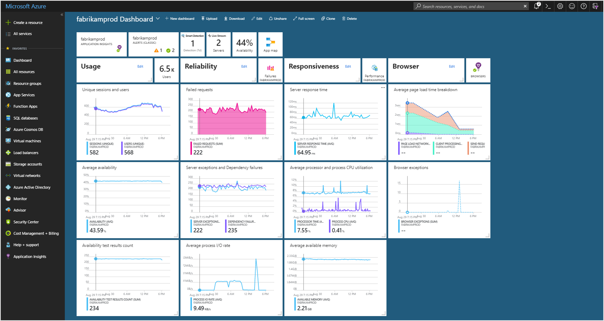

# Azure Application Insights Module

The Azure Application Insights module is an extension for the Virto Commerce platform designed to integrate Microsoft Application Insights telemetry into VirtoCommerce solutions.
It enables developers and administrators to collect, monitor, and analyze application performance, usage, and diagnostic data.

This module helps improve visibility into your application's health and usage patterns, supports proactive issue detection, and facilitates troubleshooting by providing rich analytics and logging capabilities through the Application Insights service. 

## Key features

* Collecting standard metric
* Supports Code Optimizations and Application Insights Profiler
* Collecting application telemetry data
* Collecting application trace logging data
* Flexible configuration by config and code
* Store Setting to configure Application Insights and specify the InstrumentationKey per store. 

## Screenshots



## Setup

### Enable the Application Insights

[Create an Application Insights resource](https://learn.microsoft.com/en-us/azure/azure-monitor/app/create-workspace-resource?tabs=portal) in your Azure subscription.
You can do this via the Azure Portal, Azure CLI, or ARM templates.
Once created, you will get an Connection String or Instrumentation Key that you will use to configure the module.

### Application Insights Connection String Configuration

The module can be configured via the environment variables or `appsettings.json` file. The configuration options are described in the next sections.

#### Using Environment Variables

The simplest way to configure is using the `APPLICATIONINSIGHTS_CONNECTION_STRING` environment variable to configure the Application Insights connection string:

```pwsh
$env:APPLICATIONINSIGHTS_CONNECTION_STRING = "<Copy connection string from Application Insights Resource Overview>"
```


#### Using Appsettings File

You can configure module to using the `appsettings.json`:

```JSON
{
  "ApplicationInsights": {
    "ConnectionString": "<Copy connection string from Application Insights Resource Overview>"
  }
}
```

### Code Optimizations
The module is configured to use the [Code Optimizations](https://learn.microsoft.com/en-us/azure/azure-monitor/optimization-insights/code-optimizations-profiler-overview)) feature of Application Insights.

This feature allows you to collect performance data about your application and identify bottlenecks in your code.

To enable Code Optimizations, you need to set the `EnableProfiler` option to `true` in the `appsettings.json` file or via environment variables.

```JSON
{
  "VirtoCommerce": {
    "ApplicationInsights": {
      "EnableProfiler": true
    }
  }
}
```

By default, Profiler actively collects traces every hour for 30 seconds or during periods of high CPU or memory usage for 30 seconds. The hourly traces (called sampling) are great for proactive tuning, while the high CPU and memory traces (called triggers) are useful for reactive troubleshooting.

## Configuration

The following sections describe how to use extended configuration options of the module. The configuration can be done via `appsettings.json` file or by using code.

### Application Insights Configuration
Configure Platform AP telemetry behavior inside `VirtoCommerce:ApplicationInsights` section: 

```JSON
{
    "VirtoCommerce": {
        "ApplicationInsights": {
            "SamplingOptions": {
                "Processor": "Adaptive",
                "Adaptive": {
                    "MaxTelemetryItemsPerSecond": "5",
                    "InitialSamplingPercentage": "100",
                    "MinSamplingPercentage": "0.1",
                    "MaxSamplingPercentage": "100",
                    "EvaluationInterval": "00:00:15",
                    "SamplingPercentageDecreaseTimeout": "00:02:00",
                    "SamplingPercentageIncreaseTimeout": "00:15:00",
                    "MovingAverageRatio": "0.25"
                },
                "Fixed": {
                    "SamplingPercentage": 90
                },
                "IncludedTypes": "Dependency;Event;Exception;PageView;Request;Trace",
                "ExcludedTypes": ""
            },
            "EnableProfiler": true,
            "EnableSqlCommandTextInstrumentation": true,
            "IgnoreSqlTelemetryOptions": {
                "QueryIgnoreSubstrings": [
                    "[HangFire].",
                    "sp_getapplock",
                    "sp_releaseapplock"
                ]
            }
        }
    }
}
```

`SamplingOptions.Processor`: this setting lets you chose between two sampling methods:
* **Adaptive sampling**: automatically adjusts the volume of telemetry sent from the SDK in your ASP.NET/ASP.NET Core app, and from Azure Functions. More about this configuring this option [here](https://learn.microsoft.com/en-us/azure/azure-monitor/app/sampling?tabs=net-core-new#configuring-adaptive-sampling-for-aspnet-applications). 
* **Fixed-rate sampling**: reduces the volume of telemetry sent from both the application. Unlike adaptive sampling, it reduces telemetry at a fixed rate controlled by `SamplingPercentage` setting. 

`IncludedTypes`: a semi-colon delimited list of types that you do want to subject to sampling. Recognized types are: Dependency, Event, Exception, PageView, Request, Trace. The specified types will be sampled; all telemetry of the other types will always be transmitted. All types included by default.

`ExcludedTypes`: A semi-colon delimited list of types that you do not want to be subject to sampling. Recognized types are: Dependency, Event, Exception, PageView, Request, Trace. All telemetry of the specified types is transmitted; the types that aren't specified will be sampled. Empty by default.

`EnableSqlCommandTextInstrumentation`: For SQL calls, the name of the server and database is always collected and stored as the name of the collected DependencyTelemetry. Another field, called data, can contain the full SQL query text. To opt in to SQL Text collection set this setting to `true`.

`IgnoreSqlTelemetryOptions`: Controls Application Insight telemetry processor thats excludes dependency SQL queries by. Any SQL command name or statement that contains a string from `QueryIgnoreSubstrings` options will be ignored.

'EnableProfiler`: Enables the Application Insights Profiler feature. This feature collects performance data about your application and identifies bottlenecks in your code. The profiler data is collected and uploaded to Application Insights.

This module supports configuration by config and code. You can read more about configuration [here](https://github.com/serilog-contrib/serilog-sinks-applicationinsights)


### Logging Configuration

The module comes with a [sink](https://github.com/serilog-contrib/serilog-sinks-applicationinsights) for Serilog that writes events to Microsoft Application Insights. To enable AI logging update the following `Serilog` configuration sections:

```JSON
{
  "Serilog": {
    "Using": [
      "Serilog.Sinks.ApplicationInsights"
    ],
    "WriteTo": [
      {
        "Name": "ApplicationInsights",
        "Args": {
          "connectionString": "<Copy connection string from Application Insights Resource Overview>",
          "telemetryConverter": "Serilog.Sinks.ApplicationInsights.TelemetryConverters.TraceTelemetryConverter, Serilog.Sinks.ApplicationInsights",
          "restrictedToMinimumLevel": "Error"
        }
      }
    ]
  }
}
```

The telemetryConverter has to be specified with the full type name and the assembly name. A connectionString can be omitted if it's supplied in the APPLICATIONINSIGHTS_CONNECTION_STRING environment variable.

### Configure Logging From Code

In cases where you need to configure Serilog's Application Insights sink from your code instead of the configuration file you can use special `ILoggerConfigurationService` interface:

```cs
public class ApplicationInsightsLoggerConfiguration : ILoggerConfigurationService
{
    private readonly TelemetryConfiguration _configuration;

    public ApplicationInsightsLoggerConfiguration(TelemetryConfiguration configuration)
    {
        _configuration = configuration;
    }

    public void Configure(LoggerConfiguration loggerConfiguration)
    {
        loggerConfiguration.WriteTo.ApplicationInsights(telemetryConfiguration: _configuration,
        telemetryConverter: TelemetryConverter.Traces,
        restrictedToMinimumLevel: Serilog.Events.LogEventLevel.Error);
    }
}
```

and register in `Module.cs` `Initialize` method:

```cs
public void Initialize(IServiceCollection serviceCollection)
{
    serviceCollection.AddTransient<ILoggerConfigurationService, ApplicationInsightsLoggerConfiguration>();
}
```

### Troubleshooting
1. TraceUpload.zip which are responsible for uploading the profiler data to Application Insights should be copied to the /app_data/modules/ folder of your Virto Commerce Platform instance.
1. [Troubleshoot Code Optimizations](https://learn.microsoft.com/en-us/azure/azure-monitor/optimization-insights/code-optimizations-troubleshoot)
1. [Troubleshoot Application Insights Profiler](https://learn.microsoft.com/en-us/azure/azure-monitor/profiler/profiler-troubleshooting)
1. Set `Serilog__MinimumLevel__Override__Microsoft__ApplicationInsight__Profiler1 to  `Debug` to see profiler logs and errors in the console output.

## Documentation
* [AppInsights module user documentation](https://docs.virtocommerce.org/platform/user-guide/application-insights/overview/)
* [App Insights configuration](https://docs.virtocommerce.org/platform/developer-guide/Configuration-Reference/appsettingsjson/#application-insights)
* [Configure Profiler](https://learn.microsoft.com/en-us/azure/azure-monitor/profiler/profiler-settings)
* [Logging configuration](https://docs.virtocommerce.org/platform/developer-guide/Fundamentals/Logging/overview/)
* [View on GitHub](https://github.com/VirtoCommerce/vc-module-app-insights)

## References
* [Deployment](https://docs.virtocommerce.org/platform/developer-guide/Tutorials-and-How-tos/Tutorials/deploy-module-from-source-code/)
* [Installation](https://docs.virtocommerce.org/platform/user-guide/modules-installation/)
* [Home](https://virtocommerce.com)
* [Community](https://www.virtocommerce.org)
* [Download latest release](https://github.com/VirtoCommerce/vc-module-app-insights/releases/latest)

## License
Copyright (c) Virto Solutions LTD.  All rights reserved.

This software is licensed under the Virto Commerce Open Software License (the "License"); you
may not use this file except in compliance with the License. You may
obtain a copy of the License at http://virtocommerce.com/opensourcelicense.

Unless required by the applicable law or agreed to in written form, the software
distributed under the License is provided on an "AS IS" BASIS,
WITHOUT WARRANTIES OR CONDITIONS OF ANY KIND, either express or
implied.

